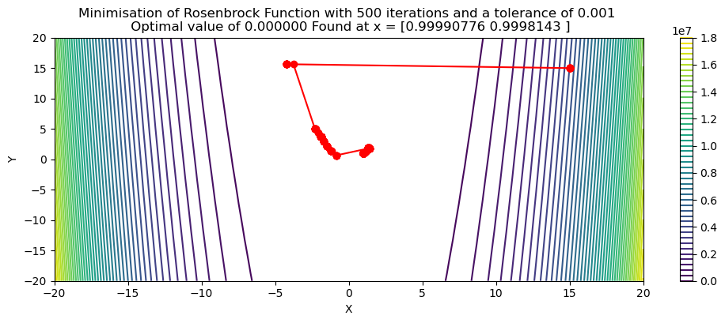

#  Broyden–Fletcher–Goldfarb–Shanno Optimisation

The Broyden–Fletcher–Goldfarb–Shanno (BFGS) algorithm is an iterative method for solving unconstrained nonlinear optimization problems. It belongs to the family of quasi-Newton methods, which are used to find local maxima and minima of functions. This is an implementation of this method in Rust, thus leveraging the higher computational efficiency of the language, and uses pyo3 to collate this into a python module.
## Sample Minimisation

## Mathematical Formulation
### Quasi-Newton Method

Quasi-Newton methods, like BFGS, build up an approximation to the Hessian matrix of second derivatives of the objective function, which is used to guide the search for the minimum. Unlike Newton's method, which requires the exact Hessian, quasi-Newton methods update the Hessian approximation iteratively.

The BFGS method provides an efficient way to approximation of the inverse Hessian matrix, \($H_k$\), at each iteration. The update formula is:

$$
H_{k+1} = H_{k} + \frac{\left( s_{k}^{\text{T}} y_{k} + y_{k}^{\text{T}} H_{k} y_{k} \right) \left( s_{k} s_{k}^{\text{T}} \right)}{\left( s_{k}^{\text{T}} y_{k} \right)^{2}} - \frac{H_{k} y_{k} s_{k}^{\text{T}} + s_{k} y_{k}^{\text{T}} H_{k}}{s_{k}^{\text{T}} y_{k}}.
$$

where:
- \($s_k = x_{k+1} - x_k$\) is the difference in the position vector.
- \($y_k = \nabla f(x_{k+1}) - \nabla f(x_k)$ \) is the difference in the gradient vector.


### Line Search

This BFGS algorithm employs a line search in a given search direction \($p_k$\) in order to find an acceptable step size \($\alpha$\) that satisfies certain conditions. The line search aims to ensure sufficient decrease in the objective function and to maintain the curvature condition. The search direction is derived from the inverse of the hessian matrix:

$$
p_k = - H_k \nabla f(x_{k})
$$

### Wolfe Conditions
In order to choose a suitable step size \($\alpha$\) in the direction of our search vector \($p_k$\), we employ two conditions (known as Wolfe conditions) in order to derive a step size which offers sufficient improvement.


1. The first condition, known as the Armijo condition ensures that the step size \($\alpha$\) provides a sufficient decrease in the objective function. It is given by:

$$
f(x_k + \alpha p_k) \leq f(x_k) + c_1 \alpha \nabla f(x_k)^T p_k 
$$

Where \($0 < c_1 < 1$\) is a constant (typically with a value of 0.0001), and \($p_k$\) is the search direction.

2. Curvature Condition
    
    The curvature condition ensures that the step size \($\alpha$\) is not too small and that the search direction is a descent direction. It is given by:
    
$$
\nabla f(x_k + \alpha p_k)^T p_k \geq c_2 \nabla f(x_k)^T p_k 
$$
    
Where \(0 < $c_2 <$ 1\) is another constant (typically at a value of 0.9).

### Further Reading


For more detailed information, refer to the following resources:
- [BFGS Algorithm on Wikipedia](https://en.wikipedia.org/wiki/BFGS_method)
- [Numerical Optimization by Jorge Nocedal and Stephen Wright](https://www.springer.com/gp/book/9780387303031)

## Implementation

For efficiency's sake, this implementation of BFGs is coded in rust, but is designed to be run in python through its use of pyo3/Maturin. This provides the utility and flexibility of python, with the enhanced computational efficiency begotten from rust.

## Quickstart

### Step 1: Install Rust

1. Open your terminal.
2. Run the following command to install Rust using `rustup` (the Rust toolchain installer):

    ```sh
    curl --proto '=https' --tlsv1.2 -sSf https://sh.rustup.rs | sh
    ```

3. Follow the on-screen instructions to complete the installation.
4. After installation, ensure that Rust is installed correctly by running:

    ```sh
    rustc --version
    ```

    This should display the version of Rust installed.

### Step 2: Install Maturin

1. With Rust installed, you can now install Maturin. Run the following command in your terminal:

    ```sh
    pip install maturin
    ```

2. Verify the installation by checking the version of Maturin:

    ```sh
    maturin --version
    ```

    This should display the version of Maturin installed.

For more information, refer to the official documentation:
- [Rust Documentation](https://www.rust-lang.org/learn)
- [Maturin Documentation](https://maturin.rs/)

### Step 3: Clone this repository
```sh
git clone https://github.com/cja119/bfgs.git
```
### Step 4: Build The Module

```sh
maturin develop
```

This should succesfully build the module and store it in your native python location (pay attention to which location it prints when the module is built)

## Example Implementation

Shown below is an example of how to use this module in Python:
### Step 1: Import the module and useful libraries
```py
import bfgs
import numpy as np
import matplotlib.pyplot as plt
```

### Step 2: Define a test function for the optimsiation and use the inbuilt funciton wrapper to pass it to Rust.
```py
def function(x):
    return 100.0 * (x[1] - x[0]**2)**2 + (1 - x[0])**2
wrapped_fn = bfgs.Wrapper(function)
```
### Step 3: Perform the optimisation
```py
x_min = bfgs.minimize(wrapped_fn, np.array([15.0,15.0]), 1e-3, 500, verbose=False)
```
### Step 3: Grab optimisation values and visualise results:
```py
f_values = bfgs.get_function_vals(wrapped_fn)
x_values = bfgs.get_x_vals(wrapped_fn)
from mpl_toolkits.mplot3d import Axes3D
lim = 20
plotlim=20
# Create a meshgrid for the surface plot
x = np.linspace(-plotlim, plotlim, 100)
y = np.linspace(-plotlim, plotlim, 100)
x, y = np.meshgrid(x, y)
z = function([x, y, np.zeros_like(x)])

contour = plt.contour(x, y, z, 50, cmap='viridis')
plt.colorbar(contour)
plt.plot(x_values[:, 0], x_values[:, 1], color='r', marker='o')
plt.xlim([-lim, lim])
plt.ylim([-lim, lim])
plt.xlabel('X')
plt.ylabel('Y')
plt.title(f'Minimisation of Rosenbrock Function with 500 iterations and a tolerance of 0.001 \n Optimal value of {function(x_values[-1]):2f} Found at x = {x_values[-1]}')

plt.gcf().set_size_inches(12, 4)
plt.show()
```
## Use of Generative Ai

Please note that generative AI has been used in places to generate the code found in this repository. If there are any copyright issues resulting from this, please reach out to me directly.
